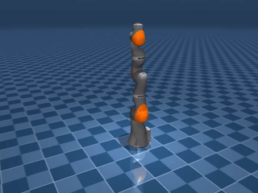

# mujoco-actuators-types

This repository contains a demo of how we can change actuators specified in `model.xml` in loaded model such that it would be possible to use `position`, `velocity` or `torque` control.

